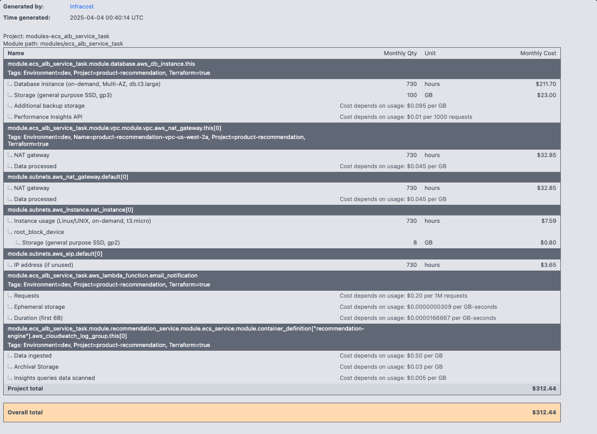

# Product Recommendation Engine Infrastructure

This Terraform project deploys a production-grade personalized product recommendation and marketing engine on AWS.

## Architecture


## Cost Estimate


## Features

- Secure VPC with public and private subnets
- Containerized application deployment using ECS
- Machine learning integration with SageMaker
- Managed PostgreSQL database using RDS
- Event-driven marketing automation
- Auto-scaling and high availability

## Prerequisites

- AWS CLI configured
- Terraform >= 1.0
- Docker (for building application container)

## Module Structure

- `vpc/` - Network infrastructure
- `ecs-svc/` - Container service deployment
- `ecs_alb_service_task/` - Load balancer integration
- `rds/` - Database infrastructure

## Usage

1. Initialize Terraform:
```bash
terraform init
```

2. Review the plan:
```bash
terraform plan
```

3. Apply the configuration:
```bash
terraform apply
```

## Security Considerations

- All data is encrypted at rest and in transit
- Network segmentation using public/private subnets
- Least privilege IAM roles
- Security groups restrict access to required ports only

## Variables

Refer to `variables.tf` for all available configuration options.

## Outputs

Refer to `outputs.tf` for all available outputs.

## License

MIT
